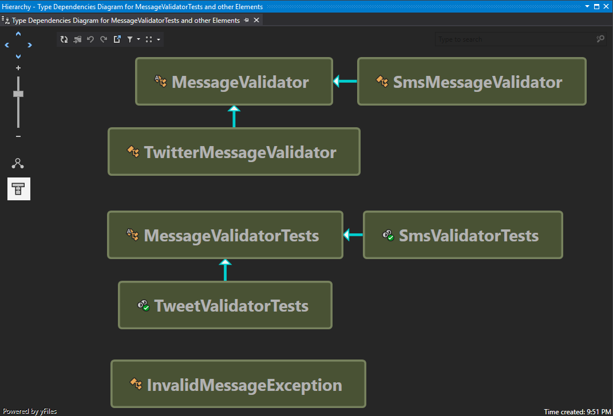
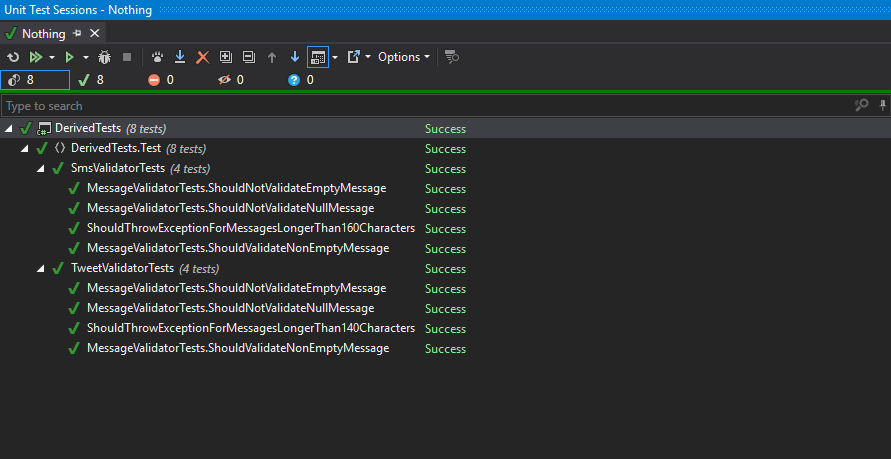

# Testing cases
## Case study for testing derived classes

```csharp
//Base Test Class. All the tests definded here are ran by the test subclasses.
public abstract class MessageValidatorTests
{
    protected MessageValidator Sut;

    [Test]
    public void ShouldNotValidateNullMessage(){/*...*/}

    [Test]
    public void ShouldNotValidateEmptyMessage(){/*...*/}

    [Test]
    public void ShouldValidateNonEmptyMessage(){/*...*/}
}
```

```csharp
[TestFixture]
public class SmsValidatorTests : MessageValidatorTests
{
    [SetUp]
    protected void SetUp()
    {
        Sut = new SmsMessageValidator();
    }

    [Test]
    public void AdditionalTestOnlyForThisSubClass(){/*...*/}
}
```




